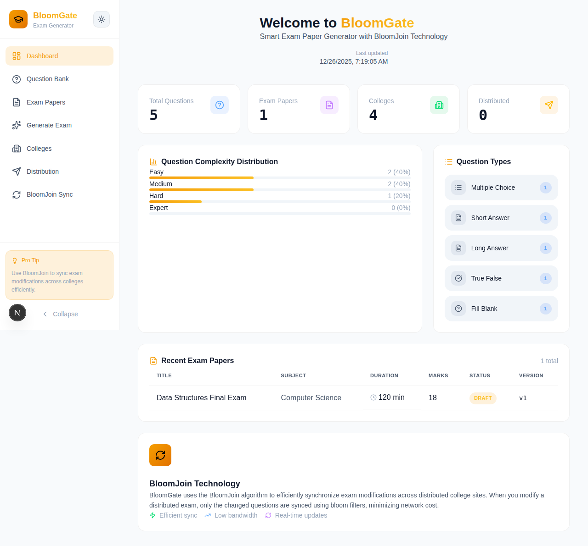
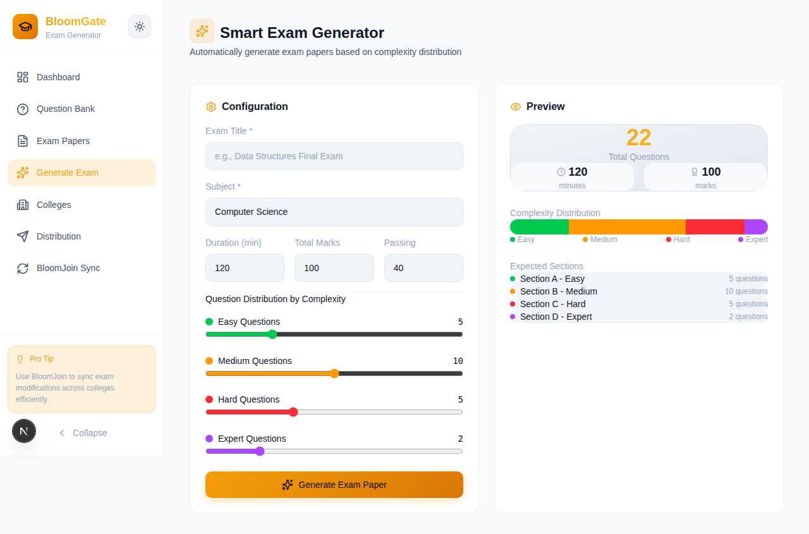
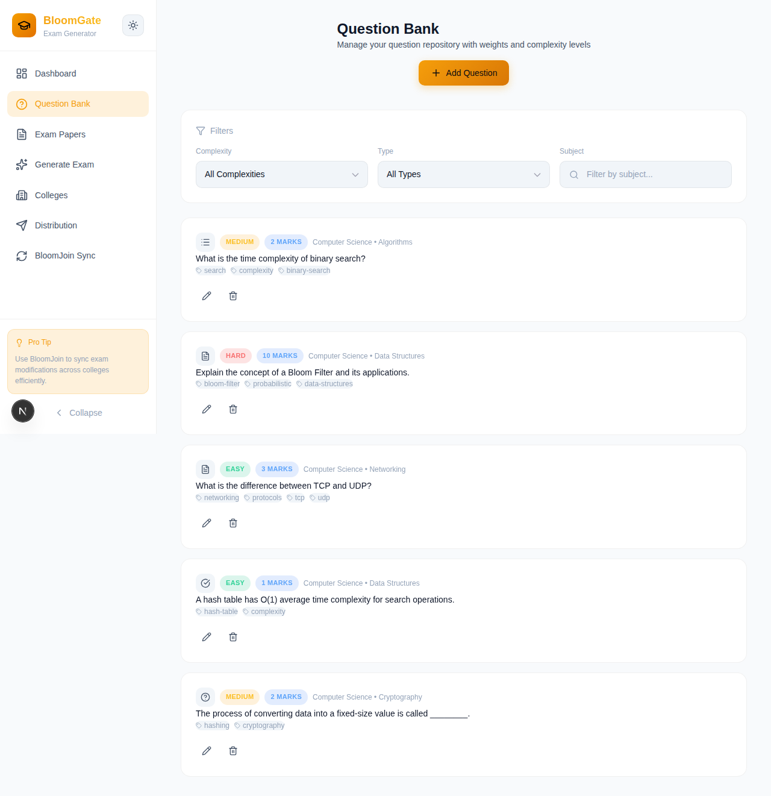
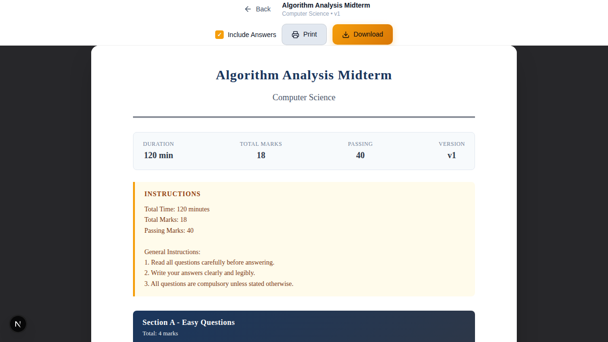

# BloomGate

**BloomGate** is a Smart Exam Paper Generator powered by **BloomJoin**. This full-stack application streamlines the process of creating, managing, and generating exam papers, utilizing advanced filtering and management techniques.

## Screenshots

### Dashboard
The main dashboard provides an overview of the system with statistics, question complexity distribution, and recent exam papers.



### Exam Generation
Generate exam papers automatically based on complexity distribution with real-time preview.



### Question Bank
Manage your question repository with weights, complexity levels, and filtering capabilities.



### PDF Preview
Preview generated exam papers with a professional layout, ready for printing or download.


### PDF with Answers
Toggle to include answers and explanations for creating answer keys.



## Project Architecture

The repository is structured as a monorepo containing two main applications:

- **Backend:** A robust RESTful API built with [NestJS](https://nestjs.com/). It handles data persistence, exam logic, question management, and the core BloomJoin algorithms.
- **Frontend:** A modern, responsive user interface built with [Next.js](https://nextjs.org/) (App Router), [React](https://react.dev/), and [Tailwind CSS](https://tailwindcss.com/).

## Tech Stack

### Backend
-   **Framework:** NestJS v11
-   **Language:** TypeScript
-   **Testing:** Jest
-   **Architecture:** Modular (Controllers, Services, Providers)

### Frontend
-   **Framework:** Next.js v16
-   **Language:** TypeScript
-   **Styling:** Tailwind CSS v4
-   **UI Library:** React v19

## Features

-   **Dashboard:** Overview of questions, exams, colleges, and distribution statistics
-   **Question Bank:** Manage questions with complexity levels (Easy, Medium, Hard, Expert), weights, and tags
-   **Exam Generation:** Automatically generate exam papers based on complexity distribution
-   **PDF Preview & Export:** View, print, and download exam papers with professional formatting
-   **Answer Key Generation:** Toggle to include answers and explanations
-   **College Management:** Register and manage colleges for exam distribution
-   **Exam Distribution:** Distribute exams to multiple colleges via email
-   **BloomJoin Sync:** Efficiently synchronize exam modifications across distributed college sites using Bloom Filters
-   **Theme Support:** Light and dark mode themes

## Getting Started

### Prerequisites
-   [Node.js](https://nodejs.org/) (Latest LTS recommended)
-   npm or yarn

### Installation & Running

#### Backend
The backend runs on `http://localhost:3001` by default.

1.  Navigate to the backend directory:
    ```bash
    cd backend
    ```
2.  Install dependencies:
    ```bash
    npm install
    ```
3.  Start the development server:
    ```bash
    npm run start:dev
    ```
4.  Run tests:
    ```bash
    npm run test
    ```

#### Frontend
The frontend runs on `http://localhost:3000` by default.

1.  Navigate to the frontend directory:
    ```bash
    cd frontend
    ```
2.  Install dependencies:
    ```bash
    npm install
    ```
3.  Start the development server:
    ```bash
    npm run dev
    ```
4.  Build for production:
    ```bash
    npm run build
    ```

## API Endpoints

The backend exposes the following API endpoints:

### Questions
- `GET /api/questions` - List all questions
- `POST /api/questions` - Create a question
- `GET /api/questions/statistics` - Get question statistics
- `GET /api/questions/:id` - Get a specific question
- `PUT /api/questions/:id` - Update a question
- `DELETE /api/questions/:id` - Delete a question

### Exams
- `GET /api/exams` - List all exams
- `POST /api/exams` - Create an exam
- `POST /api/exams/generate` - Auto-generate exam based on criteria
- `GET /api/exams/:id/pdf` - Get exam PDF
- `GET /api/exams/:id/pdf-content` - Get exam PDF content with metadata
- `POST /api/exams/distribute` - Distribute exam to colleges
- `POST /api/exams/modify` - Modify distributed exam

### Colleges
- `GET /api/exams/colleges/all` - List all colleges
- `POST /api/exams/colleges` - Create a college
- `GET /api/exams/colleges/:id` - Get a specific college

### BloomJoin
- `POST /api/bloom-filter/bloom-join` - Perform bloom join for sync

## Project Structure

```
/
├── backend/                    # NestJS API application
│   ├── src/
│   │   ├── bloom-filter/       # BloomJoin algorithm implementation
│   │   ├── email/              # Email service for distribution
│   │   ├── exams/              # Exam management & PDF generation
│   │   ├── questions/          # Question bank management
│   │   ├── app.controller.ts   # Main API controller
│   │   ├── app.module.ts       # Root module
│   │   └── main.ts             # Application entry point
│   └── test/                   # E2E tests
├── frontend/                   # Next.js Client application
│   ├── app/                    # Next.js App Router pages
│   ├── components/             # React components
│   │   ├── Dashboard.tsx       # Main dashboard
│   │   ├── QuestionBank.tsx    # Question management
│   │   ├── ExamPapers.tsx      # Exam listing
│   │   ├── GenerateExam.tsx    # Exam generation
│   │   ├── PdfViewer.tsx       # PDF preview
│   │   ├── Distribution.tsx    # Exam distribution
│   │   ├── BloomJoinSync.tsx   # BloomJoin synchronization
│   │   └── ...
│   ├── lib/                    # Utilities and API client
│   │   ├── api.ts              # Backend API integration
│   │   └── theme.tsx           # Theme provider
│   └── public/                 # Static assets
├── docs/
│   └── screenshots/            # Application screenshots
└── README.md                   # Project documentation
```

## BloomJoin Technology

BloomGate uses the BloomJoin algorithm to efficiently synchronize exam modifications across distributed college sites. When you modify a distributed exam, only the changed questions are synced using bloom filters, minimizing network cost by up to 85%.

### How It Works
1. **Create Bloom Filter:** Admin creates a bloom filter from modified question IDs
2. **Filter Records:** Colleges filter local records against the bloom filter to find matches
3. **Compute Join:** Only matching records are synced, minimizing network traffic

## License

This project is licensed under the MIT License.
